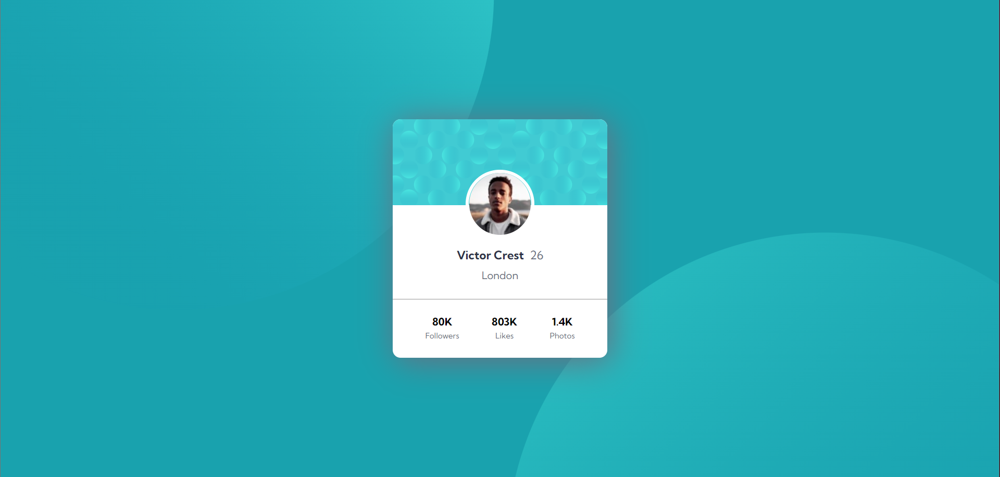

# Frontend Mentor - Profile card component solution

This is a solution to the [Profile card component challenge on Frontend Mentor](https://www.frontendmentor.io/challenges/profile-card-component-cfArpWshJ). Frontend Mentor challenges help you improve your coding skills by building realistic projects. 

## Table of contents

- [Overview](#overview)
  - [The challenge](#the-challenge)
  - [Screenshot](#screenshot)
  - [Links](#links)
- [My process](#my-process)
  - [Built with](#built-with)
  - [What I learned](#what-i-learned)
  - [Continued development](#continued-development)
  - [Useful resources](#useful-resources)
- [Author](#author)
- [Acknowledgments](#acknowledgments)

## Overview

### The challenge

- Build out the project to the designs provided

### Screenshot

### Links

- Live Soluton: [PROFILE-CARD-COMPONENT](https://amrewais.github.io/PROFILE-CARD-COMPONENT/)

## My process

### Built with

ONLY
- Semantic HTML5 markup
- CSS custom properties

### What I learned

learned to make simple and clean profile cards.
only with some simple CSS 

### Continued development

I don't need this for now but way not!

### Useful resources

MDN (https://developer.mozilla.org/en-US/docs/Web/CSS/Reference) -  simple and easy to ask for any CSS lines of code. 

## Author

- Website - working on it
- Frontend Mentor - [@AmrEwais](https://www.frontendmentor.io/profile/AmrEwais)

## Acknowledgments
just thank [@OmarYasser](https://github.com/omarYasserM) for motivate me
